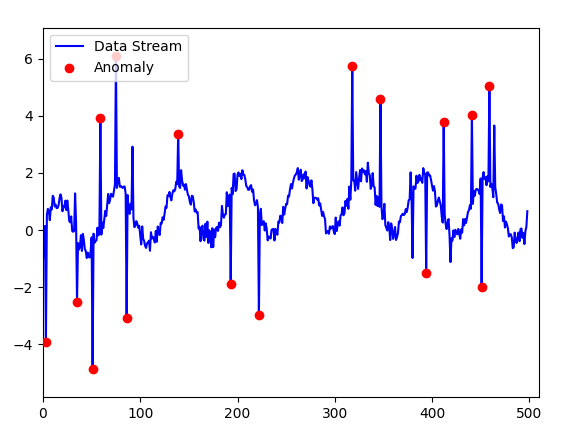

# Efficient Data Stream Anomaly Detection

## Overview

This project simulates a data stream with regular patterns and anomalies, using real-time visualization to detect and highlight unusual data points. The main objective is to provide insights into how statistical methods can be used to identify anomalies in time-series data.

## Features

- Simulates a continuous data stream, incorporating regular patterns, seasonal elements, and random noise.
- Implements anomaly detection using the Exponential Moving Average (EMA) and z-score method.
- Real-time plotting of data with highlighted anomalies.

## Algorithms Used

### Exponential Moving Average (EMA)

The Exponential Moving Average is a statistical calculation that gives more weight to recent data points, making it responsive to changes in trends. The EMA is particularly useful in time-series data because it smooths out fluctuations and helps identify the underlying trend.

**Formula:**
\[
\text{EMA}_{\text{new}} = \alpha \cdot \text{Value} + (1 - \alpha) \cdot \text{EMA}_{\text{old}}
\]


### Anomaly Detection with z-Score

The z-score method measures how many standard deviations a data point is from the mean. If a data point's z-score exceeds a specified threshold, it is flagged as an anomaly.

**Formula:**
\[
\text{z-score} = \frac{| \text{value} - \text{EMA} |}{\text{std}}
\]

### Effectiveness:
- **Sensitivity to Changes**: The EMA reacts quickly to recent changes in the data, capturing sudden shifts or trends.
- **Smoothing Noise**: While sensitive to new data points, EMA helps smooth out random noise, making it easier to spot underlying trends.
- **Less Computational Cost**: EMA is computationally efficient, as it only requires the current value and the previous EMA, making it suitable for real-time applications with large datasets.
- **Statistical Robustness**: By using z-scores, this method takes into account the variability of the data, reducing the likelihood of false positives in anomaly detection.


## Usage

1. Install the required packages:

```bash
pip install -r requirements.txt
```

2. Clone the repository or download the code.

3. Run the script using Python:
```bash
python3 main.py
```

4. A window will open displaying the simulated data stream and any detected anomalies in real time.


